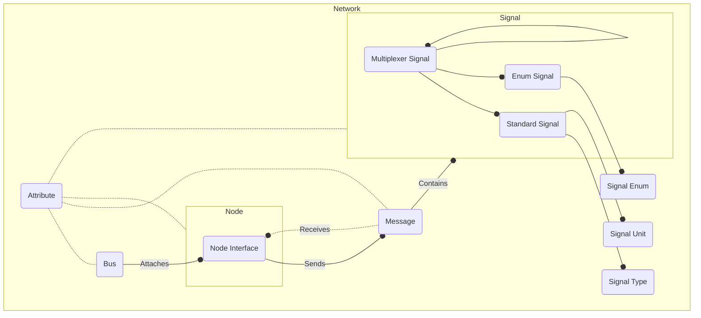

# acmelib

[](https://pkg.go.dev/github.com/squadracorsepolito/acmelib)
[](https://goreportcard.com/report/github.com/squadracorsepolito/acmelib)

A [Golang](https://go.dev/) package for modelling complex CAN networks.

The package documentation can be found [here](https://pkg.go.dev/github.com/FerroO2000/acmelib).

## Model



## Getting started

### Prerequisites

[Golang](https://go.dev/) 1.22

### Installation

Run the following Go command to install the `acmelib` package:

```sh
go get -u github.com/squadracorsepolito/acmelib
```

## TODOs

-   Adding examples
