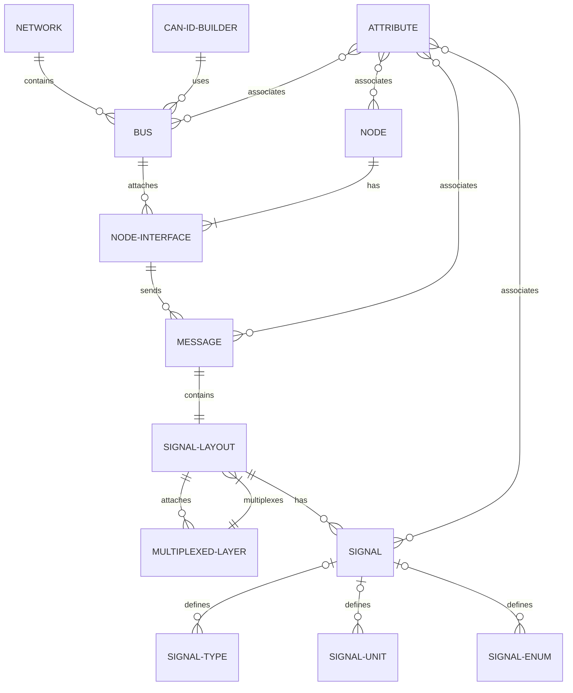

# acmelib

[](https://pkg.go.dev/github.com/squadracorsepolito/acmelib)
[](https://goreportcard.com/report/github.com/squadracorsepolito/acmelib)

A [Golang](https://go.dev/) package for modelling complex **CAN networks**. It defines data structures for representing CAN networks, buses, nodes, messages, signals, and so on.

The model can be **saved/loaded** into/from a `.binpb`, `.json`, or `.txtpb` file. Under the hood, it uses [Protocol Buffers](https://developers.google.com/protocol-buffers/) for serializing/deserializing the model, so it can be read by any language that supports Protocol Buffers. The definition of the Protocol Buffers messages can be found in the `./proto` folder. The library uses the [buf cli](https://buf.build/) for handling the .proto files.

The library also provides tools for **importing/exporting** `.dbc` files into/from the model, as well as a **decoding of raw CAN messages** (the method is owned by the [signal layout](#signal-layout) structure).

The package documentation can be found [here](https://pkg.go.dev/github.com/FerroO2000/acmelib).

> [!IMPORTANT]
> If you want to load a v1 model that contains **multiplexed signals** it is better to export the old model with the v1 version of the package into a **DBC file** and then import it (with the latest version of the package).

## Getting started

### Prerequisites

[Golang](https://go.dev/) 1.24

### Installation

Run the following Go command to install the `acmelib` package:

```sh
go get -u github.com/squadracorsepolito/acmelib
```

## Model



### Network

A `Network` models a CAN network composed of buses.

### Bus

A `Bus` models a CAN bus. It can be seen as a physical cable that connects multiple nodes.

### CAN ID Builder

A `CANIDBuilder` is a data structure in charge of generating CAN IDs for a [message](#message) sent over a [bus](#bus). It can peform operations for the CAN ID generation, like masking, shifting the message id or node id, and so on.

### Node

A `Node` models a CAN node. It can be seen as a physical device that is connected to a [bus](#bus) through a [node interface](#node-interface). A node can have multiple node interfaces.

### Node Interface

A `NodeInterface` models a CAN node interface. It can be seen as the connector mounted on a [node](#node) that is used to connect a [bus](#bus). It is the interface that sends messages on the bus because a node can send different messages in different buses.

### Message

A `Message` models a CAN message. It contains a [signal layout](#signal-layout) that has the same size of the message.

### Signal Layout

A `SignalLayout` is a data structure that owns the signals delivered in a [message](#message). It can also contains multiplexed layers if the message has multiplexed signals.

### Multiplexed Layer

A `MultiplexedLayer` is a data structure that is directly attached to a [signal layout](#signal-layout) and contains N inner signal layouts. An inner signal layout can also have a multiplexed layer, so it is possible to construct a tree of multiplexed layers.

### Signal

A `Signal` models a CAN signal. It is contained in a [signal layout](#signal-layout) (it does not matter if the signal layout is part of a [message](#message) or a [multiplexed layer](#multiplexed-layer)).

There are 3 kinds of signals:

-   Standard: it is just a regular numerical signal that has a [type](#signal-type) and an optional [unit](#signal-unit).
-   Enum: it is a signal that associates a numerical value with a string value. It has a [signal enum](#signal-enum).
-   Muxor: it is a signal used as the multiplexor of a [multiplexed layer](#multiplexed-layer).

### Signal Type

A `SignalType` models the type of a signal. It defines the size, sign, min, max, scale, and offset of the [signal](#signal).

### Signal Unit

A `SignalUnit` models the unit of a signal. It defines the unit of the [signal](#signal).

### Signal Enum

A `SignalEnum` models an enum of a signal. It contains a list of values. A value is just an index/name pair, and an optional description.

### Attribute

An `Attribute` corresponds to an attribute of a DBC file. It can be assigned to a [bus](#bus), [node](#node), [message](#message), or [signal](#signal).

There are 4 types of attributes:

-   String
-   Integer
-   Float
-   Enum
